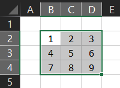

## Modern szoftverfejlesztési eszközök 2021

### 0. Feladat: Ennek a felsorolásnak a felülírása a következő adatokkal:

1. csapattag neve és GitHub felhasználóneve
2. csapattag neve és GitHub felhasználóneve
3. csapattag neve és GitHub felhasználóneve
4. csapattag neve és GitHub felhasználóneve

### 1. Feladat (határidő a PR nyitására: 10.06.)

A parancssoros táblázatkezelő program alábbi funkcióit kell implementálni egy **külön branchen**, majd nyitni belőle egy PR-t (Pull Requestet) a main branchre. Itt reviewernek fel kell kérni @oliverosz oktatót, aki majd vagy értékeli, vagy meghív egy másik oktatót értékelésre.

Elvárt funkciók:

* Tetszőleges méretű, egysoros szöveget tartalmazó cellákból álló táblázat tárolása
  * A program indításakor 1x1 méretű, 1 üres cellával
* Megjelenítés:
  * Indításkor és minden művelet után legyen megjelenítve (stdout-ra kiírva) a táblázat
  * A sorok legyenek számozva, az oszlopok nagy betűkkel jelölve (nem kell 26-nál több oszlopot kezelni)
  * Egy sor oszlopait 1-1 tabulátor karakter válassza el egymástól (hosszabb szövegeknél el fog csúszni, de most még ezzel nem kell foglalkozni)
* Műveletek (stdin-ről beolvasva):
  * `edit XY string` írja be a megadott stringet az XY koordinátájú cellába (pl. A2), a stringben lehetnek szóközök, de sortörés nem
  * `add N rows/cols` adjon hozzá N db új, üres cellákból álló sort/oszlopot a táblázat végéhez
  * `delete X/Y` törölje az X oszlopot vagy Y sort (ha betű, akkor oszlop, ha szám, akkor sor)
  * `insert N rows/cols before/after X/Y` mint az `add`, csak megadott pozícióba szúrjon be
  * `exit` lépjen ki a program
  * Bármelyik műveletnél hibás koordináta vagy paraméter esetén írjon hibaüzenetet (nem kell minden lehetséges hibára felkészíteni, de azért legyen input ellenőrzés)

### 2. Feladat (határidő a PR nyitására: 10.20.)

Ezt is (és minden további feladatot) egy új branchen kell megoldani. Ha az előző feladatos branch még nincs mergelve a mainbe, ezért abból kell leágaztatni az új branchet, nem a mainből.

A feladatokat érdemes szétosztani a csapattagok között, ehhez lehet akár több külön branchet is létrehozni, de a végén 1 branchbe legyenek egyesítve, és abból készüljön egy PR. Ha az 1. feladatos branch még nem lett mergelve a mainbe, akkor ez lesz a PR target branch, különben a main.

* A táblázatkezelő tudjon beolvasni egy táblázatot parancssori argumentumként megadott CSV fájlból ([példa](example.csv))
  * Alapból a pontosvesszőt tekintse elválasztó karakternek, de egy opcionális `-sep` kapcsolóval meg lehessen adni más karaktert is, pl.: `./prog table.csv -sep ,`
  * Ha a fájl soraiban nem egyforma számú cellák vannak, a rövidebb sorok végei legyenek üres cellákkal kiegészítve
  * A cellák végén lévő whitespace-eket hagyja figyelmen kívül
* A programban legyen egy `save filename.csv [-sep ,]` parancs, ami CSV fájlba írja ki az aktuális táblázatot
  * Ha létezik a megadott fájl, írja felül
  * Alapból pontosvesszőt használjon az értékek elválasztására, de a `-sep c` megadásával lehessen ezt változtatni
* Az elválasztó karakterek escape-elésével nem kell foglalkozni, feltételezhető, hogy a cellákban nem szerepel az elválasztó karakter
* Megjelenítés javítása:
  * Minden sorban egyforma szélességűek legyenek az egy oszlophoz tartozó cellák, a legszélesebb cella tartalmához igazodva (tartalom balra igazítva)
  * Jelenjenek meg cellaszegélyek '-' és '|' karakterekből, pl.:
```
 |A  |B    |
------------
1|Key|Value|
------------
2|0  |1    |
------------
3|1  |     |
------------
4|2  |3    |
------------
```
* Készüljön egy [GitHub Actions Workflow](https://docs.github.com/en/actions):
  * Minden push eseményre fordítsa le a kódot és végezzen egy input/output tesztet
  * Legyen egy `input.txt` fájl, ami a felhasználó által bevitt parancsokat tartalmazza, és egy elvárt kimenet, amivel összehasonlítja a program által kiírt szöveget

### 3. feladat (határidő a PR nyitására: 10.27.)

Dokumentáció:
* A függvények és osztályok legyenek ellátva Doxygen kommentekkel, ez a későbbi feladatokra is vonatkozik
* A GitHub Actions workflow-ba kerüljön bele egy új job, ami Doxygennel automatikusan legenerálja a dokumentációt, és artifactokként elérhetővé teszi HTML-ben és PDF-ben
  * A runnerre a szükséges előfeltételeket csomagkezelőből lehet telepíteni, pl.: `run: sudo apt install doxygen graphviz texlive`

Új funkciók:
* `sort by X/Y [asc/desc (default: asc)]` rendezze a táblázat sorait a megadott oszlop szerint (vagy oszlopait a megadott sor szerint) növekvő/csökkenő sorrendbe
  * A szöveges cellák string-összehasonlítással, a numerikus cellák számérték alapján legyenek összehasonlítva, egy szöveges és egy numerikus cella közül pedig mindig a szöveg a "kisebb"
    * pl.: `"" < "Abc" < "Abcd" < "Bcd" < 0 < .5 < 4 < 11 < 100.1`
  * Nem kell automatikusan újra rendezni a tartalom változása esetén
* `swap MN XY` felcseréli a megadott két cella tartalmát
* `align XY left/right` beállítja, hogy balra/jobbra igazítva legyen megjelenítve a cella tartalma
  * A cellák kezdeti igazítása tetszőlegesen megválasztható
* Range műveletek:
  * Az `MN:XY` formában megadott cellatartomány két szemközti sarka `MN` és `XY`, pl. az ábrán kijelölt range megadható úgy, hogy `B2:D4`, `D4:B2`, `B4:D2`, vagy `D2:B4` 
  * `align MN:XY left/right` egyszerre több cellának állítja be az igazítását
  * `clear MN:XY` üresre állítja a cellák tartalmát

### További feladatok

A további feladatok a template repó Readme-jében fognak megjelenni: https://github.com/SZE-MoSzE/MoSzE-Template#readme

A feladatok megjelenésekor készülni fog 1-1 PR, így aki értesítést szeretne kapni róla, az kövesse be (watch) a template repót a megfelelő notification beállításokkal.

A feladatokkal kapcsolatos kérdéseket is a template repóban a PR alatt, vagy issue létrehozásával lehet feltenni.
Saját kódra vonatkozó kérdéseket pedig a csapat repójának Feedback PR-jában vagy az adott feladathoz már létrehozott PR-ban.
